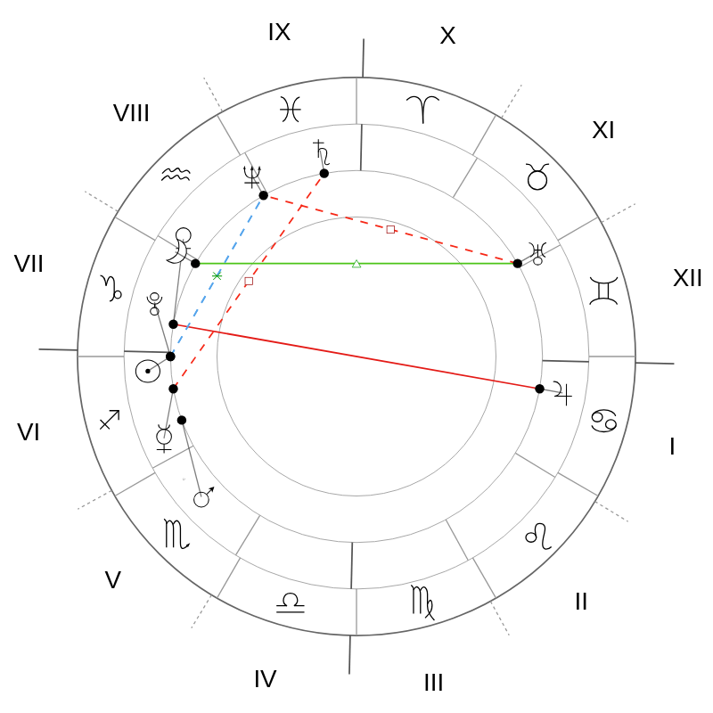

# Bug Report: Incorrect Chart Orientation

**Component:** Chart Service / nocturna-wheel library  
**Severity:** High  
**Date:** 2025-12-21  
**Reporter:** Egor (nocturna-tg team)

---

## Summary

Chart Service renders astrological charts with incorrect orientation. The charts should be rotated so that the Midheaven (MC / House X cusp) is positioned at the top (north), but currently charts use a fixed zodiac orientation with Ascendant always on the right regardless of MC position.

---

## Expected Behavior

Astrological charts should be oriented according to **horizontal coordinates** (horizon system):
- **MC (House X cusp)** should be at the **top** (zenith/north)
- **IC (House IV cusp)** should be at the **bottom** (nadir/south)
- **ASC (House I cusp)** should be near the **right** (east) 
- **DSC (House VII cusp)** should be near the **left** (west)

The entire chart (zodiac + houses + planets) should **rotate** so that MC is always at the top.

---

## Actual Behavior

Charts are rendered with **fixed zodiac orientation**:
- ASC is always positioned at the right (0° of the chart circle)
- The zodiac wheel is fixed
- MC can be at any position (top, left, bottom, right) depending on its zodiacal longitude

This means the chart does NOT rotate to place MC at the top.

---

## Test Case

**Parameters:**
- **Date:** 2025-12-21
- **Time:** 15:55:36
- **Location:** Moscow (55.7558°N, 37.6173°E)
- **Timezone:** GMT+3 (Europe/Moscow)
- **House System:** Placidus

**Calculated house cusps (from Nocturna Calculations API):**

```json
{
  "houses": [
    {"number": 1, "longitude": 91.30, "sign": "CANCER"},     // ASC
    {"number": 2, "longitude": 105.57, "sign": "CANCER"},
    {"number": 3, "longitude": 120.47, "sign": "LEO"},
    {"number": 4, "longitude": 139.45, "sign": "LEO"},       // IC
    {"number": 5, "longitude": 168.78, "sign": "VIRGO"},
    {"number": 6, "longitude": 219.22, "sign": "SCORPIO"},
    {"number": 7, "longitude": 271.30, "sign": "CAPRICORN"}, // DSC
    {"number": 8, "longitude": 285.57, "sign": "CAPRICORN"},
    {"number": 9, "longitude": 300.47, "sign": "AQUARIUS"},
    {"number": 10, "longitude": 319.45, "sign": "AQUARIUS"}, // MC
    {"number": 11, "longitude": 348.78, "sign": "PISCES"},
    {"number": 12, "longitude": 39.22, "sign": "TAURUS"}
  ]
}
```

**Key angles:**
- **ASC** (House I): 91.30° (1° Cancer)
- **IC** (House IV): 139.45° (19° Leo)
- **DSC** (House VII): 271.30° (1° Capricorn)
- **MC** (House X): 319.45° (19° Aquarius)

---

## Visual Comparison

### Reference Implementation (Correct)

Mobile app "Карта 2" with Placidus house system:

**See:** Screenshots provided separately (mobile app showing correct orientation)

**Observations:**
- ✓ MC (19° Aquarius) is positioned at the **top**
- ✓ ASC (1° Cancer) is positioned near the **right**
- ✓ Chart is **rotated** so MC is at zenith
- ✓ Houses XII and XI are visible at the top
- ✓ Houses IV and V are visible at the bottom

### Current Implementation (Incorrect)

Chart Service rendering with the same data:



**Observations:**
- ✗ MC (19° Aquarius) is positioned at the **upper-right** (~45° from top)
- ✗ ASC (1° Cancer) is positioned at the **right** (correct position in fixed zodiac)
- ✗ Chart is **NOT rotated** - zodiac orientation is fixed
- ✗ Houses IX and X are visible at the top (should be XI and XII)
- ✗ Houses III and IV are visible at the bottom (should be IV and V)

**The chart is rotated approximately 90° clockwise compared to the correct orientation.**

---

## Analysis

The `nocturna-wheel` library documentation states it provides:

> "Automatic wheel rotation based on Ascendant"

However, the charts are not being rotated correctly. The issue could be:

1. **Chart Service is not enabling rotation**: Missing parameter when calling nocturna-wheel library
2. **nocturna-wheel rotation is broken**: The library's automatic rotation feature is not working
3. **Wrong rotation reference**: The library rotates based on Ascendant, but should rotate based on Midheaven (MC)

**Note:** The documentation says "rotation based on Ascendant" but standard astrological practice is to rotate based on **Midheaven (MC)** to place it at the zenith.

---

## API Request Used

```bash
POST /api/v1/chart/render
```

```json
{
  "planets": {
    "sun": {"lon": 270.0, "lat": 0.0},
    "moon": {"lon": 300.0, "lat": 5.0},
    "mercury": {"lon": 260.0, "lat": -2.0},
    "venus": {"lon": 280.0, "lat": 1.0},
    "mars": {"lon": 250.0, "lat": -1.0},
    "jupiter": {"lon": 100.0, "lat": 0.5},
    "saturn": {"lon": 350.0, "lat": 2.0},
    "uranus": {"lon": 60.0, "lat": -0.3},
    "neptune": {"lon": 330.0, "lat": 1.0},
    "pluto": {"lon": 270.0, "lat": 15.0}
  },
  "houses": [
    {"lon": 91.30},
    {"lon": 105.57},
    {"lon": 120.47},
    {"lon": 139.45},
    {"lon": 168.78},
    {"lon": 219.22},
    {"lon": 271.30},
    {"lon": 285.57},
    {"lon": 300.47},
    {"lon": 319.45},
    {"lon": 348.78},
    {"lon": 39.22}
  ],
  "aspectSettings": {
    "enabled": true,
    "orb": 6
  },
  "renderOptions": {
    "format": "png",
    "width": 800,
    "height": 800,
    "theme": "light"
  }
}
```

---

## Expected Fix

Charts should be **rotated** so that:

1. **MC (House X cusp) is always at the top** (0° in chart rendering)
2. IC (House IV cusp) is always at the bottom (180° in chart rendering)
3. The entire chart rotates: zodiac signs, houses, planets, aspects

**Rotation formula:**
```
rotation_angle = 0° - MC_longitude
```

For this test case:
```
rotation_angle = 0° - 319.45° = -319.45° (or +40.55° counterclockwise)
```

After rotation:
- MC (319.45°) will be at position 0° (top)
- ASC (91.30°) will be at position -228.15° (or +131.85°, approximately right-lower-right)

---

## Reproduction Steps

1. Call Chart Service API with test data above
2. Observe rendered chart
3. Compare with reference implementation (mobile app screenshot)
4. Notice ~90° rotation difference

---

## Additional Context

### House Data Validation

The house cusp data from Nocturna Calculations API is **mathematically correct**:
- DSC - ASC = 271.30° - 91.30° = 180.00° ✓
- MC - IC = 319.45° - 139.45° = 180.00° ✓

The issue is **purely in the rendering orientation**, not in the calculations.

### Documentation Reference

From `third-party-docs/nocturna-image/docs/BIWHEEL_CHARTS.md`:

> The biwheel functionality is powered by the nocturna-wheel library, which provides:
> - Automatic wheel rotation based on Ascendant

This suggests the feature exists but may not be working correctly or may need to be configured/enabled.

---

## Impact

**High Priority** - This affects all chart renderings:
- Natal charts
- Transit charts  
- Synastry charts
- Biwheel charts

Charts are **technically correct** but **visually disorienting** for astrologers who expect standard orientation with MC at the top.

---

## Suggested Solution

1. **Investigate nocturna-wheel library** - check if rotation parameter exists
2. **If parameter exists** - enable it in Chart Service
3. **If feature is missing** - implement chart rotation in Chart Service or request it in nocturna-wheel
4. **Change rotation reference** - rotate based on MC (not ASC) for standard astrological orientation

---

## Environment

- **Chart Service Version:** Latest (as of 2025-12-21)
- **nocturna-wheel Library:** (version unknown, latest available)
- **Nocturna Calculations API:** Working correctly, house calculations are accurate

---

## Files Generated for Testing

- `test_chart_doc_example.png` - Chart using documentation example data
- `test_chart_our_houses.png` - Chart using Nocturna API data for Moscow
- `debug_houses.py` - Script to debug house calculations
- `test_chart_service.py` - Script to generate test charts

---

## Contact

For questions or clarifications, contact:
- **Team:** nocturna-tg
- **Reporter:** Egor
- **Project:** Telegram bot for astrological charts

